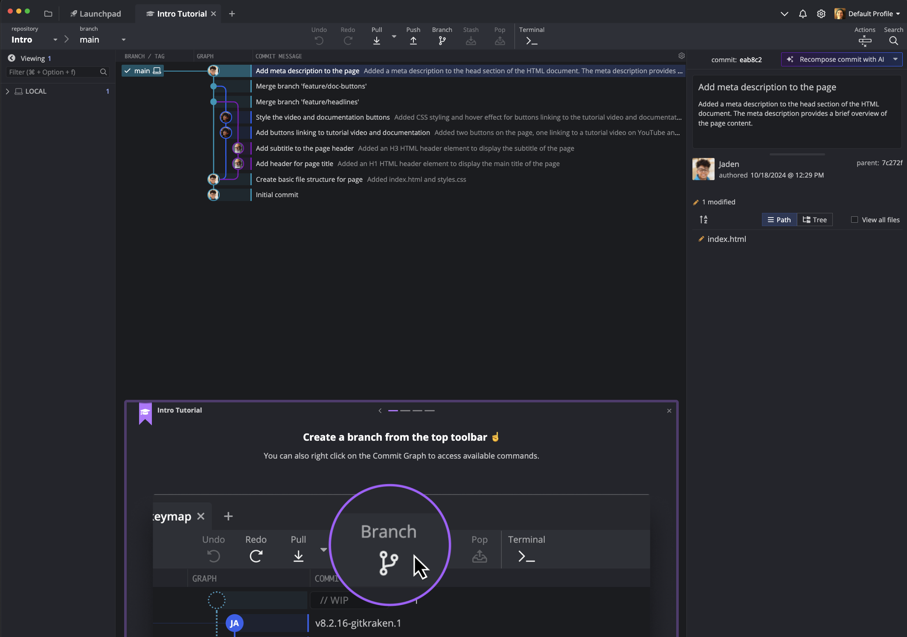
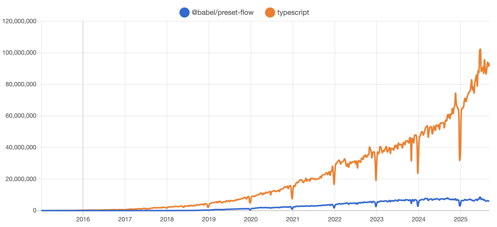

---
# try also 'default' to start simple
theme: ./theme
# random image from a curated Unsplash collection by Anthony
# like them? see https://unsplash.com/collections/94734566/slidev
background: /bg-birds.jpg
# some information about your slides (markdown enabled)
title: Welcome to Slidev
info: |
  ## Slidev Starter Template
  Presentation slides for developers.

  Learn more at [Sli.dev](https://sli.dev)
# apply UnoCSS classes to the current slide
class: text-center
# https://sli.dev/features/drawing
drawings:
  persist: false
# slide transition: https://sli.dev/guide/animations.html#slide-transitions
transition: slide-left
# enable MDC Syntax: https://sli.dev/features/mdc
mdc: true
---

<h1 class="bg-[rgba(0,0,0,0.5)] py-10 rounded-lg">Migrating 600k+ lines of code from Flow to TypeScript</h1>

---
layout: image-right
image: /self-portrait.jpg
---

# About Me


- Software Dev for ~10 years
- Developer Advocate at GitKraken
- Twitch Programming Streamer
- Snowboarder


---
layout: cover
---

# What is GitKraken?



---

# More Than Just a Git GUI


---
layout: cover
--- 

# History of GitKraken

---

# Originally Axosoft (Still, technically)


---
layout: cover
---

# Born Out of an Internal Hackathon

## 2015 | Electron |React

---
layout: cover
---

# Choosing a Type System

---
layout: cover
---


---
layout: cover
---

# Better Developer Experience

## Feedback at dev time instead of runtime

---
layout: cover
---

<div class="text-pretty">

# Catch Errors Before Your Users Do

</div>

---

# Options (at the time)

<div class="flex flex-row items-center justify-center gap-16">
  
  
  
</div>

---
layout: cover
---

# What is Flow?
 
## Made by Facebook | Open-sourced 2014 | Used in React Still

---
layout: cover
---

# Syntax Example

<div class="text-left w-[40vw] m-auto">

```js
type Param = {
  bar: ?string,
}
function myFunc(foo: Param): string {
  if (foo.bar) {
    console.log("checked!");
    // Flow errors. If you remove the console.log, it works
    return foo.bar;            
  }

  return "default string";
}
```

</div>

---
layout: cover
---

# Comparing Flow to TypeScript

---
layout: two-cols-header
---

# Usage

<div class="mt-30"></div>

::left::

<div class="text-center">

## Flow is a Babel plugin


</div>

::right::

<div class="text-center">

## Typescript has its own compiler


</div>

---
layout: two-cols-header
---

## Type Inference

<div class="mt-30"></div>

::left::

## Flow is stronger at type inference

::right::

## TypeScript generally encourages more explicit annotations


---
layout: two-cols-header
---

## Nominal vs Structural Typing

<div class="mt-24"></div>

::left::

Both are mostly structural

<div class="my-16"></div>

Flow is nominal for Classes

::right::

```ts
class Foo { name: string; }
class Bar { name: string; }

function sayName(foo: Foo) {
  console.log(foo.name);
}

sayName(new Bar());
```

---
layout: cover
---

# Strict Structural Typing

<div class="text-left w-[40vw] m-auto">

```ts
type User = {
  id: number;
  name: string;
};

function printUser(user: User) {
  console.log(`User ID: ${user.id}, Name: ${user.name}`);
}

const user1: User = { id: 1, name: 'Alice' };
printUser(user1);

const user2 = { id: 2, name: 'Bob', age: 30 };
printUser(user2); // Error in Flow, not TS

```

</div>

---
layout: two-cols-header
---

# Optional Properties

<div class="mt-20"></div>

::left::

<div class="w-[20vw] ml-40">

Flow:

```js
type User = {
  id: number;
  name: ?string;
};
```

</div>

::right::

TypeScript:

<div class="w-[20vw]">

```ts
type User = {
  id: number;
  name?: string;
};
```

</div>

---
layout: cover
---

# Why Did We Migrate?

---

# Popularity (Google trends)


---

# Popularity (NPM trends)



---
layout: two-cols-header
---

# Type Availability (centralized)

<div class="mt-20"></div>

::left::

DefinitelyTyped

[github.com/DefinitelyTyped/DefinitelyTyped](https://github.com/DefinitelyTyped/DefinitelyTyped/tree/master/types)
- 8600+ packages supported

::right::

flow-typed

[github.com/flow-typed/flow-typed](https://github.com/flow-typed/flow-typed/tree/main/definitions/npm)
- ~1000 packages supported

---
layout: two-cols-header
---

# Type Availability (package-specific)

Searched via GitHub

::left::

`"\"types\":" path:/(^|\/)package\.json$/`

1.1M results


::right::

`module.js.flow`

806 results


---
layout: cover
---

# Old Flow Version

## Performance problems | Upgrading broke things

---
layout: cover
---

# Hiring/Training Costs

---
layout: cover
---

# How Did We Migrate?

---
layout: cover
---

<div class="text-balance">

# One Dedicated Dev's Side Project

</div>

...Photo of John Alden...

---

# Code Mod (by Stripe)


---

# Code Mod Blog Post (by Stripe)


---
layout: quote
---

# Seriously unreal. I remember a short time ago laughing at the idea of typescript ever landing at Stripe, and then I woke up ~~Christmas~~ Monday morning and it was here.

\- Mike Fix, Engineer, Stripe

---
layout: cover
---

# What Are Codemods?

---


---

# Flow-To-TS Codemod Commands

<div class="flex flex-row pt-4">

<div>

- `setup`

Tools for installing TypeScript and type declarations in a project.

</div>
<div class="mt-32">

- `convert`

The main codemod, which uses Babel to convert files from Flow to TypeScript.

</div>
<div class="mt-64">

- `fix`

 A second codemod that uses [ts-morph](https://ts-morph.com/) to find, fix, suppress, and report TypeScript errors after initial conversion.

</div>
</div>

---
layout: cover
---

# Codemod Perfection?

---


---
layout: cover
---

# Third-party Libraries Had Some Custom Types

---
layout: cover
---

# Planning the Migration

## Tech Debt Sprints

---
layout: cover
---

# Overly Ambitious Estimate

## Couple days? How about a week?

---
layout: cover
---

# The Results

---
layout: cover
---

# Faster Build Times

## 40 minutes -> 20 minutes

---
layout: cover
---

# Better Developer Experience

## Faster In-editor Feedback

---
layout: cover
---

# Fewer Custom Types

---
layout: cover
---

# Faster Dev Onboarding

---
layout: cover
---

# Thanks!

## Connect With Me


